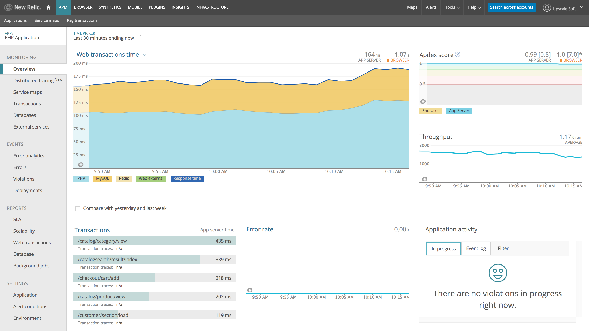

New Relic Monitoring of Swoole
==============================

This library enables monitoring of PHP applications powered by [Swoole](https://www.swoole.co.uk/) web-server via [New Relic](https://newrelic.com/) products.

**Features:**
- New Relic APM integration
- New Relic Browser integration

## Demo



## Installation

The library is to be installed via [Composer](https://getcomposer.org/) as a dependency:
```bash
composer require upscale/swoole-newrelic
```

## Usage

Monitoring of all incoming requests from start to finish can be activated via a few lines of code in the server entry point.
The monitoring instrumentation is by design completely transparent to an application running on the server.

Install the monitoring instrumentation for all requests:
```php
use Upscale\Swoole\Newrelic;

$page = <<<HTML
<!DOCTYPE html>
<html lang="en">
<head>
    <meta charset="UTF-8">
    <title>Example page</title>
</head>
<body>
    Served by Swoole server
</body>
</html>

HTML;

$server = new \Swoole\Http\Server('127.0.0.1', 8080);
$server->on('request', function ($request, $response) use ($page) {
    // PHP processing within request boundary...
    usleep(1000 * rand(100, 300));
    
    // Send response
    $response->end($page);
    
    // PHP processing outside of request boundary...
    usleep(1000 * rand(50, 150));
});

// Real user monitoring (RUM)
$rum = new Newrelic\Browser(new Newrelic\Browser\TransactionFactory());
$rum->instrument($server);

// Application performnce monitoring (APM)
$apm = new Newrelic\Apm(new Newrelic\Apm\TransactionFactory());
$apm->instrument($server);

unset($rum, $apm);

$server->start();
```

APM and Browser instrumentation can be used individually or in conjunction.
Browser MUST be instrumented first.

Browser instrumentation is applied to non-AJAX requests having `text/html` response MIME type (Swoole default).

## Limitations

Transactions are classified by New Relic APM as "Non-web transactions" due to the [CLI SAPI](https://www.php.net/manual/en/features.commandline.introduction.php) environment.

Concurrent requests subject to [coroutine](https://www.swoole.co.uk/coroutine) multi-tasking are reported as part of the first in-flight transaction.

## Contributing

Pull Requests with fixes and improvements are welcome!

## License

Copyright © Upscale Software. All rights reserved.

Licensed under the [Apache License, Version 2.0](http://www.apache.org/licenses/LICENSE-2.0).